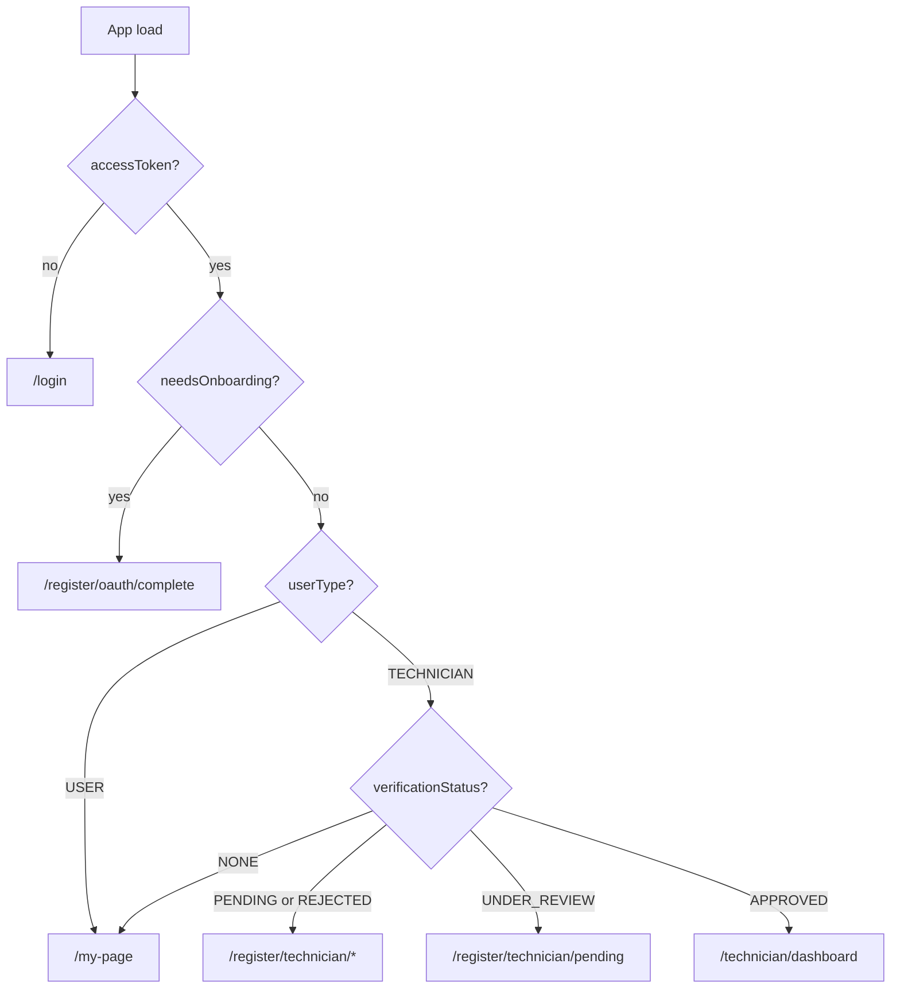

# Fixora — Auth GraphQL API (Frozen Contract)

> **Status:** Frozen for MVP frontend integration (2026-06-04)  
> **Endpoint:** `POST http://localhost:{{PORT_API}}/graphql` (default port `2000`)  
> **Authority:** [`DECISIONS.md`](DECISIONS.md) AUTH-01–07, implementation in `apps/fixora-api`  
> **Session state:** [`AI_HANDOFF.md`](AI_HANDOFF.md) · **Tasks:** [`TASK_BOARD.md`](TASK_BOARD.md)

This document is the **single GraphQL contract** for authentication, password reset, refresh tokens, and technician verification. UI wireframes: [`FIXORA-ANALIZ.md`](FIXORA-ANALIZ.md) §9.1.

---

## Conventions

| Item | Rule |
|------|------|
| **Access token** | `Authorization: Bearer <accessToken>` on guarded operations |
| **Refresh token** | Long-lived JWT; store separately; use `refreshToken` mutation to rotate |
| **Token fields on `User`** | `accessToken` and `refreshToken` are **response-only** (not persisted profile fields) |
| **Phone login** | **Not supported** (AUTH-07). `userPhoneNumber` is contact only |
| **Logout** | `logout` mutation (Bearer) revokes sessions via `refreshTokenVersion`; client must still clear stored tokens |

### Enums (auth-related)

| Enum | Values used in auth flows |
|------|---------------------------|
| `AuthProvider` | `EMAIL`, `KAKAO`, `APPLE`, `GOOGLE` |
| `UserType` | `USER`, `TECHNICIAN`, `ADMIN` |
| `VerificationStatus` | `NONE`, `PENDING`, `UNDER_REVIEW`, `APPROVED`, `REJECTED` |
| `BadgeLevel` | `NEW`, `VERIFIED`, `PREMIUM_PRO` |

### Initial state after signup / OAuth complete

| Role | `profileComplete` | `verificationStatus` | `badgeLevel` |
|------|-------------------|------------------------|--------------|
| Customer (`USER`) | `true` | `NONE` | `NEW` |
| Technician (`TECHNICIAN`) | `true` (email signup) / after OAuth complete | `PENDING` | `NEW` |
| OAuth stub (before `completeOAuthSignup`) | `false` | `NONE` (default) | `NEW` |

---

## 1. Email signup — `signup`

| | |
|--|--|
| **Operation** | `mutation signup(input: UserInput!): User!` |
| **Auth** | None (public) |
| **Task** | P1-08 |

### Input: `UserInput`

| Field | Type | Required | Notes |
|-------|------|----------|-------|
| `userEmail` | `String!` | Yes | Normalized to lowercase |
| `userNickname` | `String!` | Yes | Length 3–12 |
| `userPassword` | `String!` | Yes | Length 5–12 |
| `userPhoneNumber` | `String!` | Yes | KR contact (`010…` / `+821…`) |
| `userType` | `UserType!` | Yes | `USER` or `TECHNICIAN` (not `ADMIN`) |
| `termsAcceptedAt` | `DateTime!` | Yes | |

### Return: `User`

Key fields for routing:

| Field | Customer | Technician |
|-------|----------|------------|
| `authProvider` | `EMAIL` | `EMAIL` |
| `profileComplete` | `true` | `true` |
| `verificationStatus` | `NONE` | `PENDING` |
| `accessToken` | issued | issued |
| `refreshToken` | issued | issued |

### Example

```graphql
mutation Signup($input: UserInput!) {
  signup(input: $input) {
    _id
    userType
    authProvider
    profileComplete
    verificationStatus
    badgeLevel
    accessToken
    refreshToken
  }
}
```

---

## 2. Email login — `login`

| | |
|--|--|
| **Operation** | `mutation login(input: LoginInput!): User!` |
| **Auth** | None (public) |
| **Task** | P1-08 |

### Input: `LoginInput`

| Field | Type | Required |
|-------|------|----------|
| `userEmail` | `String!` | Yes |
| `userPassword` | `String!` | Yes (5–12) |

### Return: `User`

Same token fields as `signup`. Rejects accounts with `authProvider !== EMAIL` or missing password (`OAUTH_LOGIN_REQUIRED`).

---

## 3. OAuth login — `loginWithOAuth`

| | |
|--|--|
| **Operation** | `mutation loginWithOAuth(input: OAuthLoginInput!): OAuthLoginResult!` |
| **Auth** | None (public) |
| **Task** | P1-09 |

### Input: `OAuthLoginInput`

| Field | Type | Required | Notes |
|-------|------|----------|-------|
| `authProvider` | `AuthProvider!` | Yes | `KAKAO`, `GOOGLE`, or `APPLE` (API may block `APPLE`) |
| `token` | `String!` | Yes | Provider-specific: see field description in schema |

**Token formats:**

| Provider | `token` value |
|----------|----------------|
| `GOOGLE` | OAuth authorization code or ID token |
| `KAKAO` | Authorization code or access token |
| `APPLE` | ID token (API: may return `APPLE_LOGIN_COMING_SOON`) |

### Return: `OAuthLoginResult`

| Field | Type | Routing use |
|-------|------|-------------|
| `user` | `User!` | Profile stub or full user; tokens also copied onto `user` in resolver |
| `accessToken` | `String!` | Store for API calls |
| `refreshToken` | `String!` | Store for rotation (P1-06) |
| `needsOnboarding` | `Boolean!` | **`true`** → incomplete OAuth profile → frontend must run onboarding |

**`needsOnboarding` rule:** `needsOnboarding === !user.profileComplete`

| `needsOnboarding` | `profileComplete` | Frontend route |
|-------------------|-------------------|----------------|
| `true` | `false` | `/register/role?oauth=1` → `completeOAuthSignup` |
| `false` | `true` | Main app (`/my-page` or role dashboard) |

Returning user with completed profile receives full tokens without onboarding.

---

## 4. OAuth profile completion — `completeOAuthSignup`

| | |
|--|--|
| **Operation** | `mutation completeOAuthSignup(input: CompleteOAuthSignupInput!): User!` |
| **Auth** | **Bearer required** (`AuthGuard`) — use access token from stub `loginWithOAuth` |
| **Task** | P1-09b |

### Eligibility

- `authProvider` is `KAKAO`, `APPLE`, or `GOOGLE`
- `profileComplete === false`
- Not available for `EMAIL` accounts

### Input: `CompleteOAuthSignupInput`

| Field | Type | Required | Notes |
|-------|------|----------|-------|
| `userPhoneNumber` | `String!` | Yes | KR contact |
| `userNickname` | `String!` | Yes | 3–12 |
| `userType` | `UserType!` | Yes | `USER` or `TECHNICIAN` |
| `termsAcceptedAt` | `DateTime!` | Yes | |
| `userEmail` | `String` | If stub has no email | Must match existing email if already set |

### Return: `User`

Sets `profileComplete: true`. Technician → `verificationStatus: PENDING`. New **`accessToken`** + **`refreshToken`** issued.

---

## 5. Refresh session — `refreshToken` (P1-06)

| | |
|--|--|
| **Operation** | `mutation refreshToken(input: RefreshTokenInput!): User!` |
| **Auth** | None — credential is the refresh JWT in input |
| **Note** | Operation name is **`refreshToken`** (singular), not `refreshTokens` |

### Input: `RefreshTokenInput`

| Field | Type | Required |
|-------|------|----------|
| `refreshToken` | `String!` | Yes |

### Return: `User`

New **`accessToken`** and **`refreshToken`** (rotation). Previous refresh token invalid after successful call.

### Env (API)

| Variable | Default |
|----------|---------|
| `ACCESS_TOKEN_EXPIRES` | `1d` |
| `REFRESH_TOKEN_EXPIRES` | `30d` |
| `SECRET_REFRESH` | required in production |

### Frontend pattern

On GraphQL `401` / expired access: call `refreshToken` once with stored refresh token → retry original request with new access token. See `fixora-web` `REFRESH_TOKEN_MUTATION` (Apollo link wiring optional).

---

## 6. Logout — `logout`

| | |
|--|--|
| **Operation** | `mutation logout: LogoutResult!` |
| **Auth** | `Authorization: Bearer <accessToken>` (`AuthGuard`) |
| **Task** | P1-06 (session revoke + client storage) |

### Return: `LogoutResult`

| Field | Type | Notes |
|-------|------|-------|
| `success` | `Boolean!` | `true` on success |
| `message` | `String!` | e.g. `Logged out successfully.` |

### Server behavior

1. Increments `refreshTokenVersion` on the authenticated user (same mechanism as refresh rotation and password reset).
2. All outstanding **access** and **refresh** JWTs for that user become invalid on guarded routes and on `refreshToken`.
3. `AuthGuard` / `RolesGuard` compare the access token’s embedded `refreshTokenVersion` with the DB value (`SESSION_REVOKED` if mismatch).

### Client contract (required after mutation)

1. Call `logout` while the access token is still valid (best effort if network fails).
2. Remove `accessToken` and `refreshToken` from local storage (`clearAuthTokens()`).
3. Clear `needsOnboarding` flag if used.
4. Redirect to `/login`.

### Example

```graphql
mutation Logout {
  logout {
    success
    message
  }
}
```

---

## 7. Forgot password — `requestPasswordReset` (P2-FP)

| | |
|--|--|
| **Operation** | `mutation requestPasswordReset(userEmail: String!): PasswordResetRequestResult!` |
| **Auth** | None (public) |

### Input

| Arg | Type |
|-----|------|
| `userEmail` | `String!` |

### Return: `PasswordResetRequestResult`

| Field | Value |
|-------|--------|
| `message` | Always generic (no email enumeration) |

**Always returns success message** whether or not the email exists.

**Email sent only when:** `authProvider === EMAIL`, password set, user active, rate limit OK (max 3/hour per user).

**Dev:** If `SMTP_HOST` unset, reset link logged to API console.

**Link format:** `{PASSWORD_RESET_URL}?token=<hex>` (default `http://localhost:3000/reset-password`)

---

## 8. Reset password — `resetPassword` (P2-FP)

| | |
|--|--|
| **Operation** | `mutation resetPassword(input: ResetPasswordInput!): PasswordResetRequestResult!` |
| **Auth** | None (public) |

### Input: `ResetPasswordInput`

| Field | Type | Required |
|-------|------|----------|
| `token` | `String!` | From email/link |
| `newPassword` | `String!` | Length 5–12 (same as login) |

### Return: `PasswordResetRequestResult`

| Field | On success |
|-------|------------|
| `message` | Password reset confirmation string |

**Errors:**

| Case | Error |
|------|-------|
| Invalid/expired token | `INVALID_PASSWORD_RESET_TOKEN` |
| OAuth-only account | `OAUTH_LOGIN_REQUIRED` |

**Side effect:** Increments `refreshTokenVersion` — all prior refresh tokens invalidated.

---

## 9. Technician verification (P2-07)

Technician onboarding uses the **same `signup`** mutation with `userType: TECHNICIAN` — there is **no** separate `technicianSignup` API.

Supporting operations: `updateUser` (profile + `verificationDocuments`), `imagesUploader`, then verification mutations below.

### 9.1 Submit — `submitTechnicianVerification`

| | |
|--|--|
| **Operation** | `mutation submitTechnicianVerification: User!` |
| **Auth** | Bearer + **`UserType.TECHNICIAN`** (`RolesGuard`) |

### Input

None (uses `@AuthUser` id).

### Preconditions

| Check | Requirement |
|-------|-------------|
| `userType` | `TECHNICIAN` |
| `verificationDocuments` | `.length > 0` (set via prior `updateUser`) |
| `verificationStatus` | `PENDING` or `REJECTED` |

### Effect

`verificationStatus` → `UNDER_REVIEW`; clears `verificationRejectionReason`.

### 9.2 Approve — `approveTechnician`

| | |
|--|--|
| **Operation** | `mutation approveTechnician(userId: String!): User!` |
| **Auth** | Bearer + **`UserType.ADMIN`** |

### Effect (AUTH-05 / AUTH-06)

| Field | Value |
|-------|--------|
| `verificationStatus` | `APPROVED` |
| `badgeLevel` | `VERIFIED` |
| `isVerified` | `true` |

### 9.3 Reject — `rejectTechnician`

| | |
|--|--|
| **Operation** | `mutation rejectTechnician(userId: String!, reason: String): User!` |
| **Auth** | Bearer + **`UserType.ADMIN`** |

### Effect

| Field | Value |
|-------|--------|
| `verificationStatus` | `REJECTED` |
| `badgeLevel` | `NEW` |
| `isVerified` | `false` |
| `verificationRejectionReason` | optional `reason` persisted |

Technician may re-upload docs and call `submitTechnicianVerification` again from `REJECTED`.

### 9.4 Admin queue — `getTechnicianVerificationQueue`

| | |
|--|--|
| **Operation** | `query getTechnicianVerificationQueue(input: TechnicianVerificationInquiry!): Users!` |
| **Auth** | Bearer + **`UserType.ADMIN`** |

### Input: `TechnicianVerificationInquiry`

| Field | Type | Required |
|-------|------|----------|
| `page` | `Int!` | Yes |
| `limit` | `Int!` | Yes |
| `sort` | `String` | Optional |
| `direction` | `Direction` | Optional |
| `search.text` | `String` | Optional nickname filter |

### Return: `Users`

`list` of technicians with `verificationStatus: UNDER_REVIEW`, plus `metaCounter`.

---

## Frontend routing rules (summary)



| Condition | Route (fixora-web convention) |
|-----------|-------------------------------|
| No tokens | `/login` |
| `needsOnboarding === true` | `/register/role?oauth=1` → `/register/oauth/complete` |
| Email/OAuth signup, `USER` | `/my-page` |
| `TECHNICIAN` + `PENDING` / `REJECTED` | Onboarding steps + ID upload |
| `TECHNICIAN` + `UNDER_REVIEW` | `/register/technician/pending` |
| `TECHNICIAN` + `APPROVED` | Technician dashboard |
| Forgot password link | `/reset-password?token=...` (page TBD) |

**Protected API calls:** Send `Authorization: Bearer <accessToken>`. Do not send refresh token to `AuthGuard` endpoints.

**Technician booking accept:** Backend requires `verificationStatus === APPROVED` (`acceptBooking`).

---

## Operation index

| Operation | Type | Auth | Task |
|-----------|------|------|------|
| `signup` | Mutation | Public | P1-08 |
| `login` | Mutation | Public | P1-08 |
| `loginWithOAuth` | Mutation | Public | P1-09 |
| `completeOAuthSignup` | Mutation | Bearer | P1-09b |
| `refreshToken` | Mutation | Public (refresh JWT) | P1-06 |
| `logout` | Mutation | Bearer | P1-06 |
| `requestPasswordReset` | Mutation | Public | P2-FP |
| `resetPassword` | Mutation | Public | P2-FP |
| `submitTechnicianVerification` | Mutation | Bearer TECHNICIAN | P2-07 |
| `approveTechnician` | Mutation | Bearer ADMIN | P2-07 |
| `rejectTechnician` | Mutation | Bearer ADMIN | P2-07 |
| `getTechnicianVerificationQueue` | Query | Bearer ADMIN | P2-07 |

---

## Related documents

| Doc | Purpose |
|-----|---------|
| [`AI_HANDOFF.md`](AI_HANDOFF.md) | Current implementation status and env vars |
| [`TASK_BOARD.md`](TASK_BOARD.md) | Task IDs P1-08, P1-09, P1-09b, P1-06, P2-FP, P2-04, P2-07 |
| [`DECISIONS.md`](DECISIONS.md) | AUTH-01–07 business rules |
| [`AUTH_E2E.md`](AUTH_E2E.md) | Postman examples (email/OAuth subset) |
| [`AUTH_IMPLEMENTATION_PLAN.md`](AUTH_IMPLEMENTATION_PLAN.md) | Historical implementation phases |

---

## Changelog

| Date | Change |
|------|--------|
| 2026-06-04 | Initial frozen contract: P1-08/09/09b, P1-06, P2-FP, P2-07 |
